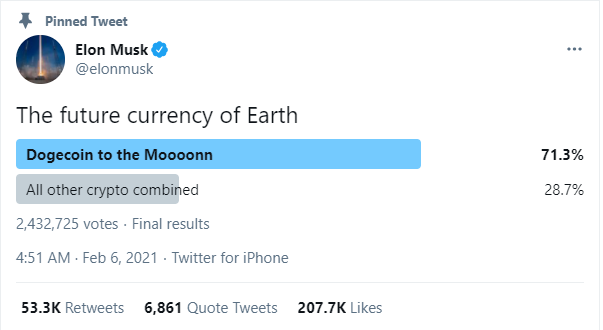
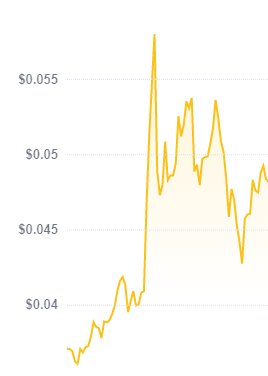

# Crypto-Predictions
Our entry for the Royal Hackaway 2021 event.

## What the project is?
The project is designed to track trending news stories and twitter posts and marks them against the prices to look for huge jumps or drops in price. 6 currencies can be selected from the watch list and it will show related stories and tweets.

## Our Motivation
After watching the explosion of stocks such as Gamestop and Dogecoin, thanks to r/wallstreetbets and Elon Musk, we wanted to build something that could collate this data and analyse patterns between what is being said and the impact on the price.

The photo of the graph is from a few hours after Elon Musk tweeted this poll showing the huge effect his tweets can have on the currency. 

## How to run?
* Activate virtual environment for flask server
  * Windows = .\crypto-predictions-flask\venv\Scripts\activate.bat
  * Mac & Linux = Source .\crypto-predictions-flask\venv\Scripts\activate
  
* Setup react server
  * Navigate into crypto-predictions-react
  * run npm install && npm start
